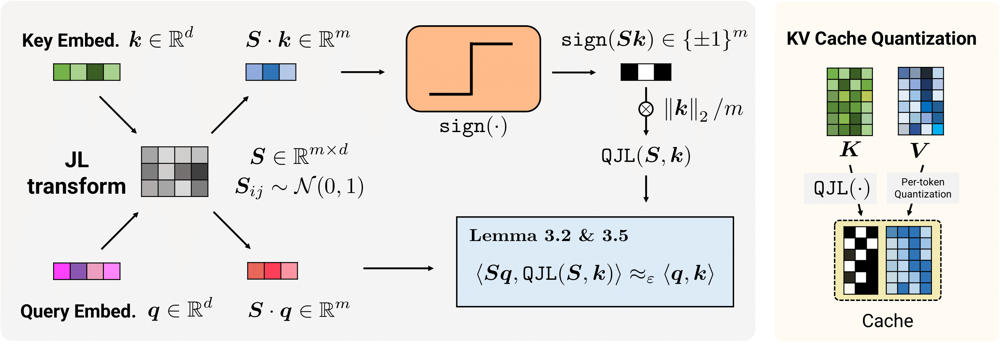
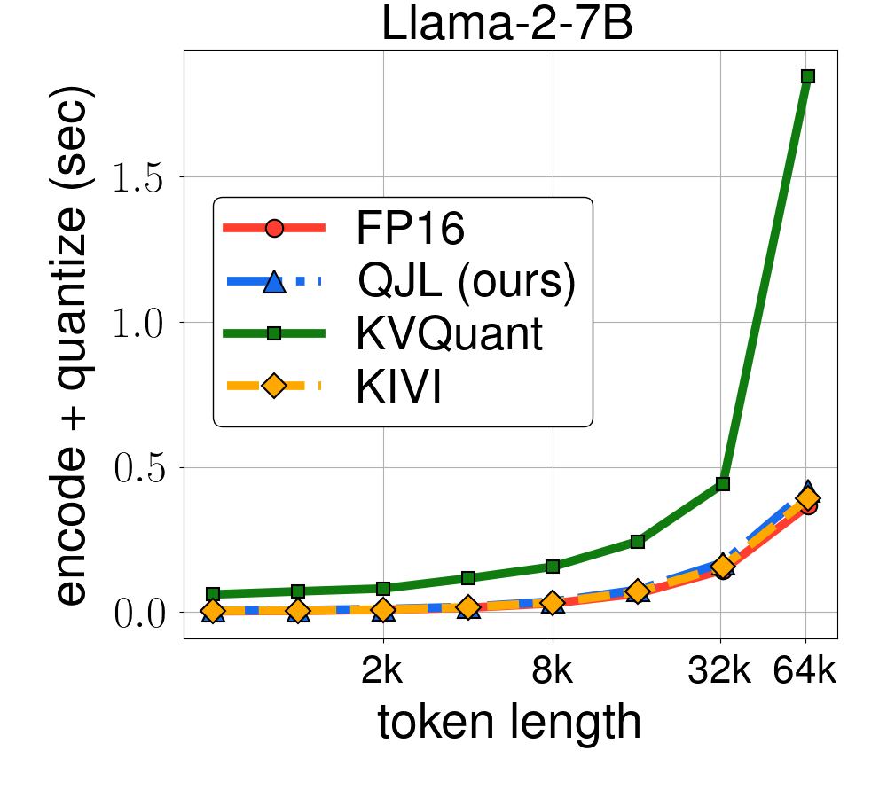
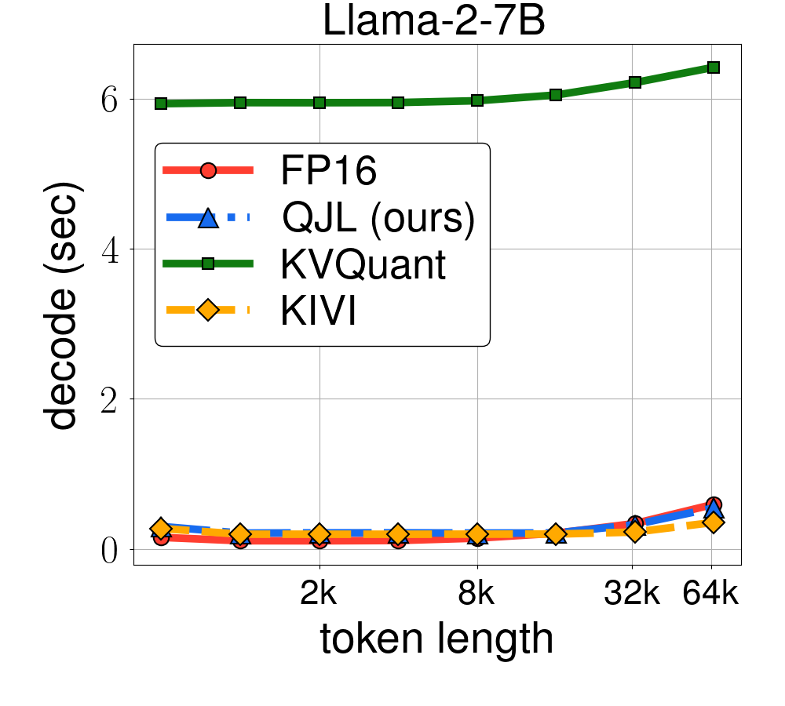
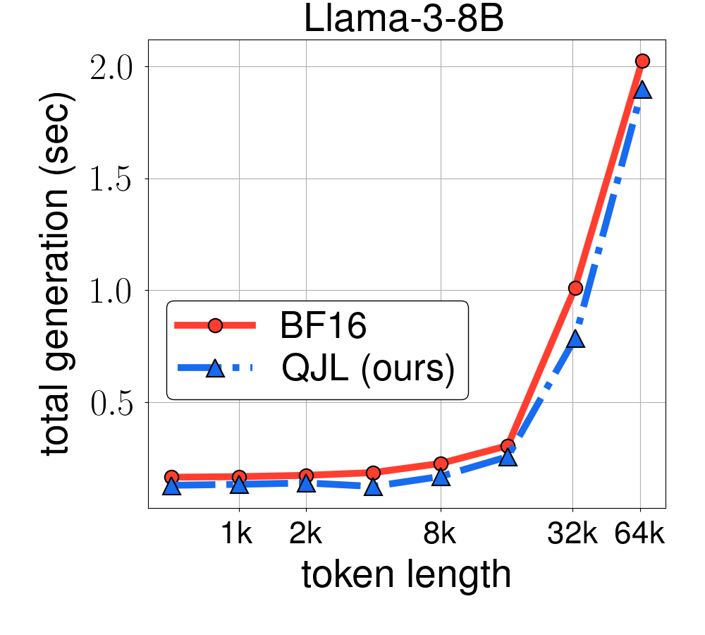

# QJL
[1-Bit Quantized JL Transform for KV Cache Quantization with Zero Overhead](https://arxiv.org/pdf/2406.03482) 


## Overview
QJL (Quantized Johnson-Lindenstrauss) is a novel approach to compress the Key-Value (KV) cache in large language models (LLMs). QJL applies a Johnson-Lindenstrauss transform followed by sign-bit quantization, resulting in a 1-bit representation of key embeddings. Unlike existing methods, QJL eliminates memory overheads by removing the need to store quantization constants while providing an unbiased estimator for inner products with minimal distortion.


QJL achieves high relative distortion accuracy on attention scores. It handles practical considerations like outliers in key embeddings and uses an orthogonalized JL transform for improved performance. The method is designed to be efficient and GPU-friendly, with lightweight CUDA kernels for core operations.



Experimental results demonstrate QJL's effectiveness across various LLMs, including Llama-2 and Llama-3, on multiple NLP tasks. QJL achieves a significant reduction in KV cache memory usage (3 bits per float vs. 16 bits) while maintaining or slightly improving accuracy compared to baselines and other quantization methods. It also shows faster runtime, especially for long sequences, and supports different precision formats and grouped query attention, making it compatible with newer LLM architectures. Overall, QJL offers a memory-efficient, fast, and accurate solution for KV cache quantization, addressing a significant bottleneck in serving LLMs, particularly for long-context applications.


## Installation
1. Clone the repository:
    ```sh
    git clone git@github.com:amirzandieh/QJL.git
    cd QJL
    ```

2. Install the required packages:
    ```sh
    pip install -r requirements.txt
    ```

3. Set up the QJL kernel:
    ```sh
    cd qjl_kernel
    python setup.py install
    ```

## Evaluate QJL on LongBench

QJL supports Llama 2/3 family models (e.g., ``longchat-7b-v1.5-32k``). To evaluate QJL on LongBench, use the following example :
```sh
python longbench.py --model_name "lmsys/longchat-7b-v1.5-32k" \
    --dtype "float16" \
    --key_quantization_bits 256 \
    --key_quantization_bits_initial_layers 512 \
    --initial_layers_count 15 \
    --outlier_count_general 8 \
    --outlier_count_initial_layers 8 \
    --value_quantization_bits 2 \
    --group_size 32 \
    --buffer_size 128 \
    --seed 42 \
    --dataset_name [dataset_name] \
    --n_data 150
```

### Plot Runtime
To plot the runtime, use the following command:
```sh
python plot_runtime.py
```
|  |  |  |
|:---------------------------------------------------------------------:|:----------------------------------------------------------------------:|:-----------------------------------------------------:|